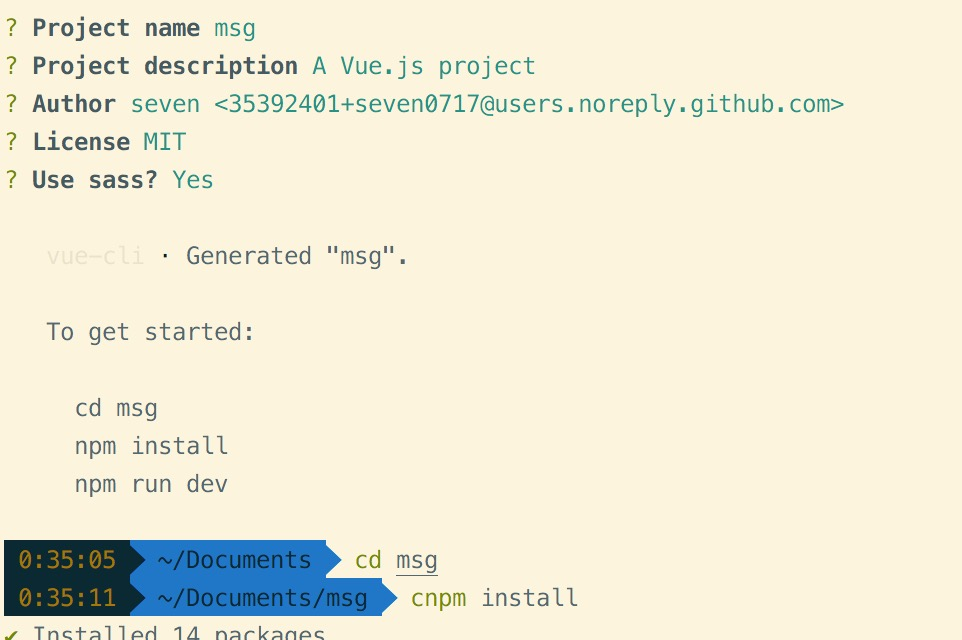
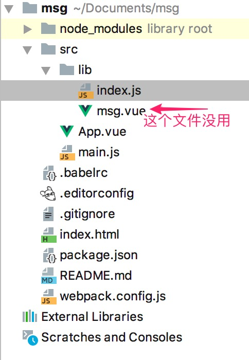
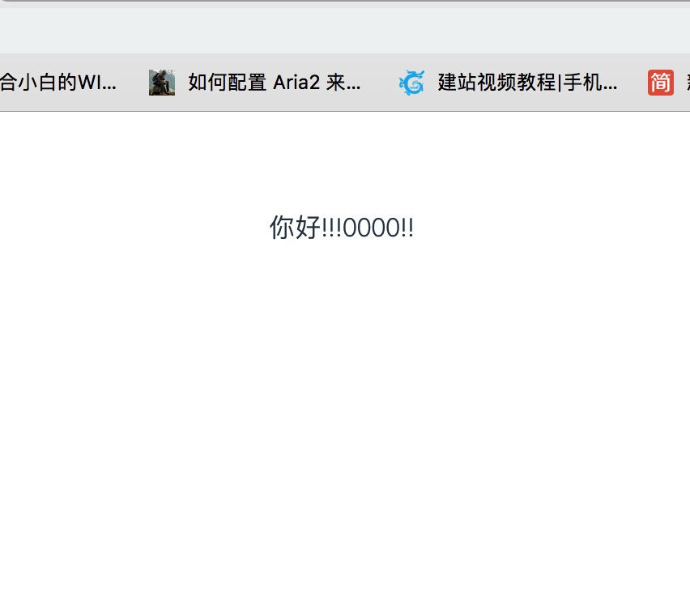
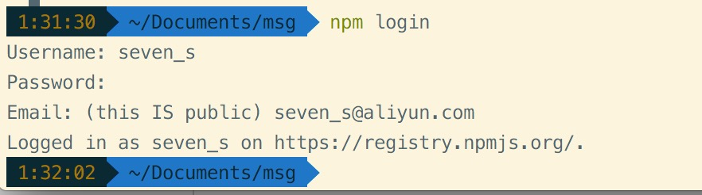

# vue插件
> vue init webpack-simple msg(msg是插件的名字)
> 

>在src下新建一个文件夹lib
>在lib下新建一个js（index.js）
>把src下没用的东西删掉
>
## msg.vue着个文件用不到忽略
在index.js下

        const msg = {
          install(Vue,options){
          // 写一个方法 传入值之后返回出去
            Vue.prototype.$msg = (chuan)=> {
              return chuan
            }
            // Vue.component(ms.name,ms)
          }
        };
        
        if(typeof window != 'undefined' && window.Vue){
          window.Vue.use(msg)
        }
        
        export default msg;
        
在main.js中加入

    import ms from './lib/index'
    Vue.use(ms)
    
在app.vue中使用

    <template>
         

            {{gogo}}
        

    </template>
    
    
    
显示效果如下
    
    这里只是简单的演示 没有做样式的书写，关于这样的例子网上很多，我就不多写了
    
## 发布
首先修改package.json,加入这两行
    
     "private": false, // 如果是true会发布失败
    "main": "dist/msg.js",  // 打包后使用会直接去找这个文件（重要）
    
接下来修改webpack.config.js

        module.exports = {
      entry: './src/lib/index.js', //打包入口
      output: {
        path: path.resolve(__dirname, './dist'),
        publicPath: '/dist/',
        filename: 'index.js',  //打包后的文件名
        library:"index",  // library指定的就是你使用require时的模块名，这里便是
        libraryTarget: "umd", //libraryTarget会生成不同umd的代码,可以只是commonjs标准的，也可以是指amd标准的，也可以只是通过script标签引入的。
        umdNamedDefine: true  // 会对 UMD 的构建过程中的 AMD 模块进行命名。否则就使用匿名的 define。
      },
      
结下来修改index.html

    <!DOCTYPE html>
    <html lang="en">
      <head>
        <meta charset="utf-8">
        <title>msg</title>
      </head>
      <body>
        

        
      </body>
    </html>

最后打包 npm run build

在终端 npm login 登陆npm

然后 npm publish 等待进度条走完就ok了